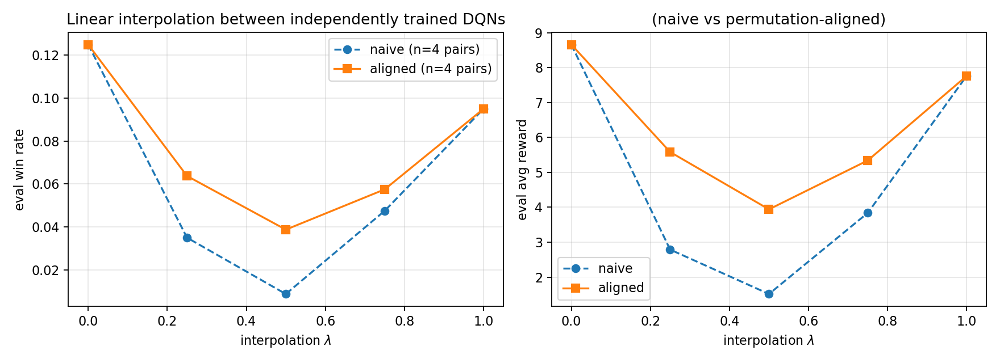
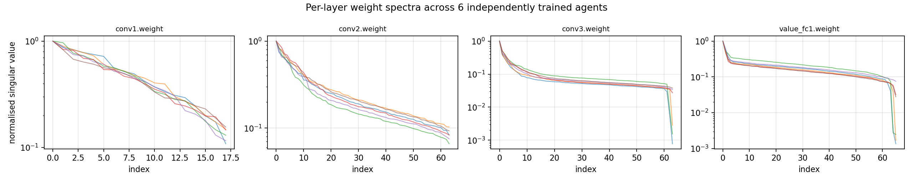
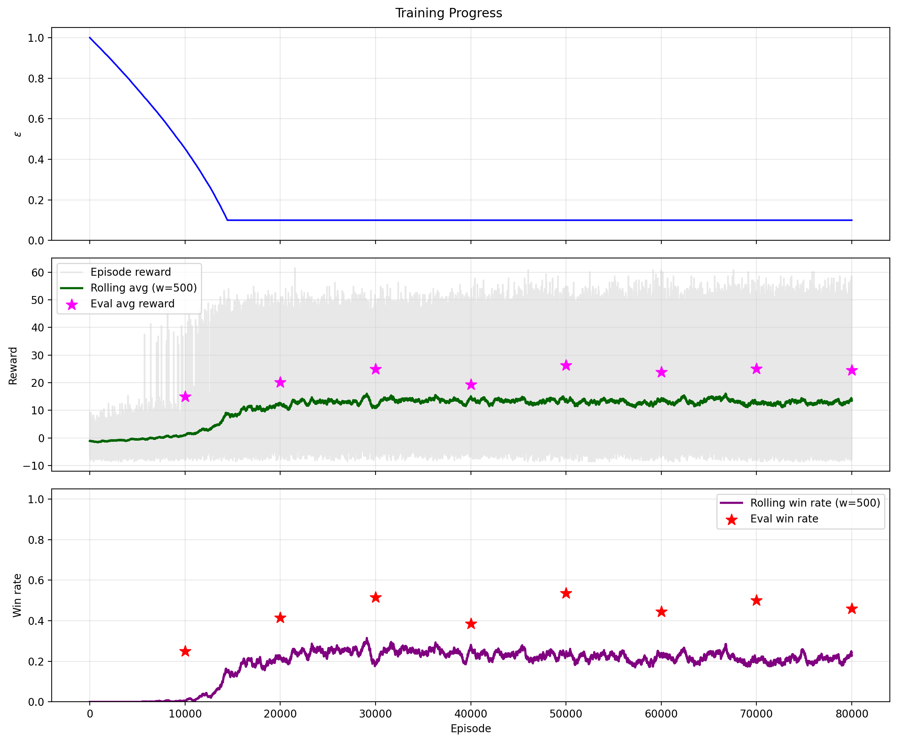

# Minesweeper-RL

A Minesweeper agent studied through the symmetries of the game.

Two solvers over the same board: a **fully convolutional dueling DQN** that
reads the board as a two-plane image and outputs one Q value per cell, and a
**deductive constraint solver** (SAT/SMT) that uses symmetry reduction over
the dihedral group D4 via Burnside's lemma. The learned side now carries the
same group structure as the deductive side: D4 test-time augmentation, a
hand-rolled **p4m group-equivariant** variant of the network, and a
**weight-space analysis** of independently trained agents (permutation
alignment and interpolation barriers).

Originally a BSc final project (University of Leeds); the symmetry and
weight-space extensions were added afterwards.

## The network

```
spatial (B, 2, H, W)  covered mask, clue/8
        │  3×3 conv ×3 (32, 64, 64)
        ├── advantage: 1×1 conv → per-cell Q-map (B, H·W)   translation-equivariant
        └── value: global avg pool + [covered_ratio, mine_density] → MLP
Q = value + (advantage − mean)
```

No layer has a size-dependent weight shape, so **one set of weights runs on
any board size**. The equivariant variant (`minesweeper/equivariant.py`)
replaces the convolutions with D4 group convolutions (lifting + group conv,
group pooling before the heads), making the Q-map equivariant to rotations
and reflections of the board *by construction* — verified numerically in
`tests/test_equivariance.py` on all 8 group elements.

## Results

Shipped checkpoint (`best_model_batch5_*.pt`, trained on 8×8/10), evaluated
for 400 episodes per cell, greedy play with ε = 0.01. **TTA** = averaging
Q-maps over the board's symmetry orbit, same weights, no retraining: all 8
D4 elements on square boards, the 4 axis-preserving elements on the
non-square 16×30 board.

| board (zero-shot except 8×8) | win rate | win rate + D4 TTA | avg reward | avg reward + TTA |
|---|---|---|---|---|
| 8×8, 10 mines        | 50.5% | **70.5%** | 24.6 | **34.4** |
| 16×16, 40 mines      | 1.3%  | **16.0%** | 20.2 | **48.0** |
| 16×30, 99 mines      | 0.0%  | 0.0%      | 7.4  | **10.9** |

Two observations. The fully convolutional weights transfer across board
sizes without any retraining (the 16×16 and 16×30 rows are the 8×8 weights).
And respecting the game's symmetry group at inference is worth +20 points of
win rate on the training size, and a ~13× win-rate multiplier on the 16×16
zero-shot transfer (on 16×30 neither variant wins games, though TTA still
raises average reward by ~48%).

### Three-way ablation: where should the symmetry live?

Plain FCN vs the same weights with D4 TTA vs the p4m-equivariant network,
all trained for the same 3,000-episode budget on 8×8/10 (500 eval episodes
per cell; `scripts/run_ablation.py`):

| model (matched budget) | 8×8 win rate | 16×16 zero-shot win rate |
|---|---|---|
| plain FCN              | 15.0% | 0.0% |
| plain FCN + D4 TTA     | 15.4% | 0.0% |
| **p4m-equivariant**    | **34.0%** | 0.6% |

The two symmetry mechanisms do different jobs. Orbit-averaging at inference
(TTA) is worth +20 points of win rate on a well-trained model (the shipped
checkpoint above) but almost nothing on an undertrained one — symmetrising a
weak Q function just averages its noise. Building the symmetry into the
architecture pays during **training**: at the same budget the equivariant
network more than doubles the plain network's win rate, and it also beats a
plain run trained 2.5× longer (20.0% at 7,500 episodes, same eval protocol).

## Weight-space analysis

`wsl/` treats the trained agents themselves as data. The architecture's
neuron-permutation symmetry group is a product of four symmetric groups
(over the three conv-channel axes and the value-MLP hidden axis);
`wsl/align.py` implements Git Re-Basin style **weight matching** over it,
and matching a permuted copy of a network recovers it exactly
(`tests/test_align.py`).

Linear interpolation between independently trained agents (6-agent seed
zoo; 4 pairs, each pairing the seed-1 agent with a different partner;
200 eval episodes per point):

<p align="center"></p>

Naive interpolation collapses at the midpoint (anchor agent 12.5% win,
partners 7.5–12%, naive midpoint mean 0.9%). Permutation alignment roughly
quadruples the midpoint mean (3.9%) and lies above the naive curve at every
interior lambda in the 4-pair average (individual pairs vary) — but it does
**not** close the barrier: these independently trained agents are not
linearly mode-connected even after alignment, consistent with what is
reported for small networks trained from scratch.

<p align="center"></p>

The per-layer singular value spectra are strikingly consistent across
seeds, and two layers (conv3, value_fc1) carry a **near-flat
bulk** — long runs of nearly equal singular values — which is exactly the
regime where truncation-based spectral methods are perturbation-sensitive
(the subspace attached to a cluster of near-equal singular values is only
determined up to rotation within the cluster).

Reproduce: `scripts/train_zoo.py`, then `scripts/wsl_report.py`.

## Layout

```
minesweeper/         headless package: board, env, models, replay, train, eval, d4, equivariant
wsl/                 permutation alignment + spectra
scripts/             train_zoo, run_ablation, wsl_report
tests/               D4 group axioms, numerical equivariance, alignment recovery
Minesweeper_Solver.py   the original PyQt GUI app (play, watch the agent, deductive solvers)
Graph_Pattern_Generation2.py   pattern mining for the deductive solver
```

## Run

```bash
python3 -m pytest tests/ -q                      # group + equivariance + alignment tests
python3 -m minesweeper.train --rows 8 --cols 8 --mines 10 \
    --episodes-per-batch 1500 --num-batches 2 \
    --epsilon-decay-steps 15000 --learning-starts 500 --target-sync-steps 2000
python3 -m minesweeper.eval <checkpoint> --episodes 400 --sizes 8x8x10,16x16x40,16x30x99
python3 -m minesweeper.eval <checkpoint> --episodes 400 --sizes 8x8x10,16x16x40,16x30x99 --tta
python3 scripts/train_zoo.py --seeds 1 2 3 4 5 6 --episodes 2500
python3 scripts/wsl_report.py --zoo "checkpoints/zoo/*_best.pt" --pairs 4
python3 Minesweeper_Solver.py                    # the GUI
```

Training defaults mirror the original project; the flags above use a faster
exploration schedule sized for short runs. PyTorch with CUDA, Apple-Silicon
MPS, or CPU.

<p align="center"></p>
